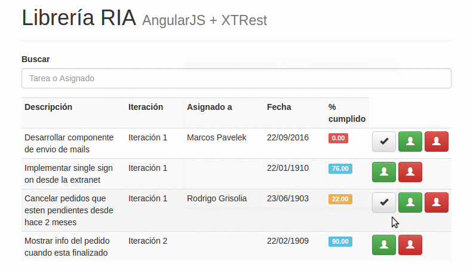

# Lista de TO-DO (Tareas pendientes) en Angular 2

</img>

Configuracion:

* En la consola ir a la carpeta Angular2 y correr "npm install & npm install -g @angular/cli"
* Ejecutar "ng build --output-path '../webapp'" cada vez que se haga algun cambio para volver a compilar el codigo typescript en javascript
* Correrlo a traves del IDE o con la consola dentro de la carpeta principal ejecutando "mvn clean install exec:java"

